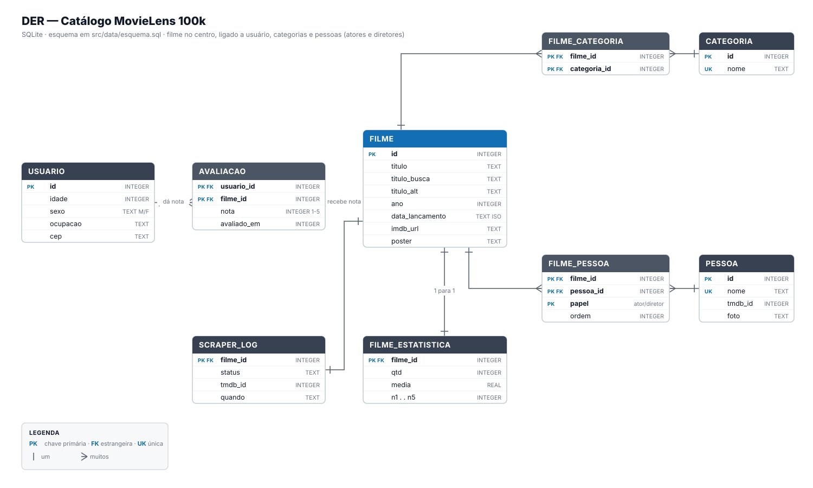
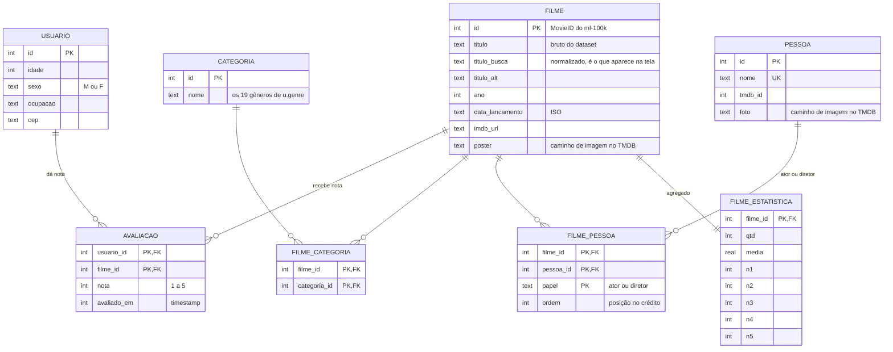

# Esquema do banco

SQLite. O DDL está em [`src/data/esquema.sql`](../src/data/esquema.sql) e é
aplicado por `src/data/carga.py` a cada carga do ml-100k (apaga e recria tudo).

## O desenho

O centro é **filme**. Em volta dele, as quatro coisas do catálogo: quem
avaliou (**usuário**), o que ele é (**categorias**) e quem fez (**atores** e
diretores).



O mesmo diagrama em Mermaid, para quem quiser editar:



## Tabela por tabela

| Tabela | O que guarda | De onde vem |
|---|---|---|
| `filme` | 1.682 filmes: título, ano, link do IMDb, pôster | `u.item` (+ pôster do TMDB) |
| `categoria` | Os 19 gêneros | `u.genre` |
| `filme_categoria` | N:N filme × gênero — um filme pode ter vários | `u.item` |
| `pessoa` | Atores e diretores, com foto | TMDB, via scraper |
| `filme_pessoa` | N:N filme × pessoa, com `papel` e `ordem` de crédito | TMDB, via scraper |
| `usuario` | 943 usuários: idade, sexo, ocupação, CEP | `u.user` |
| `avaliacao` | 100.000 notas de 1 a 5, PK (usuário, filme) | `u.data` |
| `filme_estatistica` | Agregado por filme: qtd, média e contagem por nota | calculado na carga |
| `scraper_log` | Progresso do scraper por filme, para retomar de onde parou | criado pelo scraper |

## Três decisões

**As ligações N:N ficam em tabela própria.** Um filme está em vários gêneros e
tem vários atores; um ator está em vários filmes. `filme_categoria` e
`filme_pessoa` são só os pares. Em `filme_pessoa`, `papel` faz parte da chave —
a mesma pessoa pode dirigir e atuar no mesmo filme.

**`filme_estatistica` é redundante de propósito.** Média e contagem por nota
dão para calcular a partir de `avaliacao`, mas o top 10 e cada página da
listagem teriam que varrer 100 mil linhas. Como a base é fechada (não entra
avaliação nova), o agregado é calculado uma vez, na carga.

**`pessoa` e `filme_pessoa` nascem vazias.** O ml-100k não traz elenco nem
direção em lugar nenhum — nem no `u.item`, nem em arquivo separado. Quem
preenche é `src/services/scraper.py`, casando título e ano contra o TMDB.

## Conferindo um banco já criado

```bash
sqlite3 movielens.db ".schema"
sqlite3 movielens.db "SELECT COUNT(*) FROM filme, avaliacao, usuario;"
```
